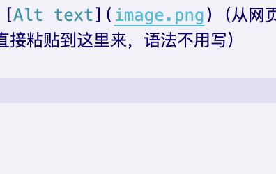

# Class Text

# 第一章

如何使用vscode来做笔记

## 第一节

准备工作——需要下载的插件

### 第一小节

md等等

## 第二节

需要学习的语法

### markdown方面的语法
#### 有四级标题吗
##### 五
###### 六（最多到六）


用#来表示三级标题

---

段落和段落之间要隔一行.

就像这样.

---

三条横线 (或更多的横线) 表示分割线.

---
==~~***这部分是重点内容,符号要紧贴着不要空格***~~==

**重点加粗**

*斜体*

~~删除线~~

==高亮==

选中文本之后, 按下 Ctrl + B 可以给选中文本**加粗**.

同理 Ctrl + I 可以让选中文本变为*斜体*.

---
* 列表测试
  * 1
  * 2
    * 3
    * 4

1. 有序列表（序号+.+**空格**）
2. a
   1. b
   2. 

* 无序列表
  * 嵌套无序列表
  * 嵌套无序列表
* 无序列表
* 无序列表

1. 有序列表 1
   1. 嵌套有序列表 1
   2. 嵌套有序列表 2
2. 有序列表 2
3. 有序列表 3

任务列表：

- [x] wrwc
- [x] dwc
- [ ] csvv
- [ ]  

任务列表:(可以在预览窗口点击✅)

- [x] 已经完成的事 1
- [x] 已经完成的事 2
- [ ] 已经完成的事 3
- [x] 仍未完成的事 4
- [x] 仍未完成的事 5
- [ ] hhh

---
要进行缩进 (书写嵌套列表), 你可以使用 VS Code 的快捷键 Ctrl + [ 和 Ctrl + ]
这个快捷键可以将代码向左或向右进行缩进!(==没有试验成功，还需要再研究一下==)

---
以下内容感觉是用来写程序说明的
> 引用内容

`行内代码`

代码块语法：

```print("hello world")```

引用文本:

> 引用别人说的话
> 就这样写
> By. OrangeX4

这是 `行内代码` 语法.

代码块语法:

''' python
print("Hello, World!")
'''

注意要将 ' 替换成 `.

---
插入超链接和图片，例如, 可以使用网址和图床:

[笔记教程](https://orangex4.cool/post/notes-in-markdown/)


也可以在本地用相对地址:

[文件路径](wenjian.md)（好像只有本文件夹的md/其他可打开的文件可以？）

（本地有图片的话可以右键拷贝直接粘贴到这里来，语法不用写）

（从网页上看的图像也可以右键拷贝直接粘贴到这里来，语法不用写）

==（截图的是右键“存储到剪贴板”再粘贴，或许可以再简化？，还需要研究）==

---
| 韵母 | 声母 | 非扭矩可|
| ---- | ---- |----|
| 内容 | 内容 |
| >    | 内容 |

==(照说是合并单元格，为什么不行)==

| **表头** | **表头**词比较和v难不成 |
| ---- | ---- |
| 内cjmn bejnmafn容 | 内容 |
| ^    | 内容 |

自动表格对齐:==Shift + Alt + F(mac是什么键)==

---
注释：（显示不出来）
<!-- 显示的出来吗 还可以
多行-->
---
上下标：
上标：$x^y$
下标：$x_{多个字要加花括号}$

---
打印PDF

在右侧预览栏右键菜单, 选择 在浏览器中打开.
在浏览器中右键选择 打印.

---
原生快捷键

通用**操作**
Ctrl + C, 复制当前文本
Ctrl + V, 粘贴当前文本
Ctrl + Z, 撤销
Ctrl + Shift + Z, 反撤销
Shift + Alt + F, 整理代码
Ctrl + /, 将当前行注释 / 反注释, 当多行文本被选中时, 将多行文本注释
光标**操作**
Ctrl + ← 将光标向左移动一个单词
Ctrl + → 将光标向右移动一个单词
Ctrl + Alt + ↑, 向上加入一个光标
Ctrl + Alt + ↓, 向下加入一个光标
Ctrl + Alt + U, 撤销上次光标**操作**
界面移动
Ctrl + ↑ 向上移动当前界面
Ctrl + → 向下移动当前界面
选中**操作**
Shift + ← 向左选中 / 反选中一个字符 (重要)
Shift + → 向右选中 / 反选中一个字符 (重要)
Ctrl + Shift + ← 向左选中 / 反选中一个单词 (重要)
Ctrl + Shift + → 向右选中 / 反选中一个单词 (重要)
Ctrl + D 当前有选中文本时, 将下一个与其相同的文本加入选中 (重要)
文本行**操作**
Ctrl + C 当前无选中文本时, 复制当前行
Shift + Alt + ↑ 向上复制当前行, 当多行文本被选中时, 向上复制多行 (重要)
Shift + Alt + ↓ 向下复制当前行, 当多行文本被选中时, 向下复制多行 (重要)
Alt + ↑ 向上移动当前行, 当多行文本被选中时, 将当前多行文本向上移动 (重要)
Alt + ↓ 向下移动当前行, 当多行文本被选中时, 将当前多行文本向下移动 (重要)
插件增加的快捷键

Markdown 语法
Ctrl + B 当前有选中文本时, 将文本加粗
Ctrl + I 当前有选中文本时, 将文本变为斜体
Ctrl + M 进入数学公式模式 (加入美元符)
图片粘贴
Ctrl + Alt + V 粘贴剪贴板图片 (本地)
Ctrl + Alt + V 粘贴剪贴板图片 (图床)
光标**操作**
Ctrl + Alt + U 将多选光标变为单选
选中**操作**
Shift + Alt + ← 向左复制当前选中文本 (重要)
Shift + Alt + → 向右复制当前选中文本 (重要)
Alt + ← 向左移动当前选中文本一个字符 (重要)
Alt + → 向右移动当前选中文本一个字符 (重要)
Ctrl + Alt + ← 向左移动当前选中文本一个单词 (重要)
Ctrl + Alt + → 向右移动当前选中文本一个单词 (重要)
计算器功能
Ctrl + Shift + Alt + E 计算当前选中表达式, 用等号连接并输出
Ctrl + Shift + Alt + R 计算当前选中表达式, 并替换当前选中表达式
Ctrl + Shift + Alt + D 定义当前选中表达式, 无输出
